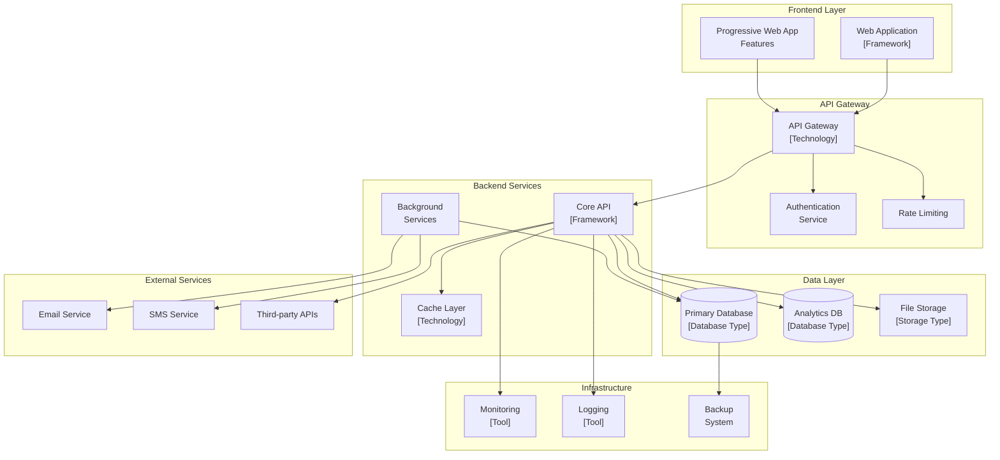

# [PROJECT NAME] - Technical Documentation Template

> **Version**: 1.0  
> **Last Updated**: [DATE]  
> **Author**: [AUTHOR NAME]  
> **Team**: [TEAM NAME]  

---

## Table of Contents

1. [Executive Summary](#executive-summary)
2. [System Architecture](#system-architecture)
3. [Technology Stack](#technology-stack)
4. [Application Structure](#application-structure)
5. [Backend Specifications](#backend-specifications)
6. [Frontend Specifications](#frontend-specifications)
7. [Database Design](#database-design)
8. [API Design](#api-design)
9. [Security Implementation](#security-implementation)
10. [Performance & Scalability](#performance--scalability)
11. [Development Guidelines](#development-guidelines)
12. [Deployment Strategy](#deployment-strategy)
13. [Testing Strategy](#testing-strategy)
14. [Monitoring & Observability](#monitoring--observability)
15. [Development Roadmap](#development-roadmap)
16. [UI/UX Technical Design Spec](#uiux-technical-design-spec)
17. [Conclusion](#conclusion)

---

## Executive Summary

### Project Overview
[Brief description of the project, its purpose, and main objectives]

### Key Features
- [Feature 1]: [Description]
- [Feature 2]: [Description]
- [Feature 3]: [Description]
- [Feature 4]: [Description]

### Target Users
- **[User Type 1]**: [Description of user role and needs]
- **[User Type 2]**: [Description of user role and needs]
- **[User Type 3]**: [Description of user role and needs]

### Success Criteria
- [Metric 1]: [Target value]
- [Metric 2]: [Target value]
- [Metric 3]: [Target value]
- [Metric 4]: [Target value]

---

## System Architecture

### Architecture Overview



### Core Components

#### Frontend Application
- **Technology**: [Framework/Library]
- **Features**: [List key features]
- **Deployment**: [Deployment method]

#### Backend API
- **Technology**: [Framework/Language]
- **Architecture**: [Pattern - e.g., Clean Architecture, MVC]
- **Features**: [List key features]

#### Database Layer
- **Primary Database**: [Database type and purpose]
- **Analytics Database**: [Database type and purpose]
- **Caching**: [Caching solution]

---

## Technology Stack

### Backend Technologies

| Component | Technology | Version | Purpose |
|-----------|------------|---------|----------|
| **Runtime** | [Runtime] | [Version] | [Purpose] |
| **Framework** | [Framework] | [Version] | [Purpose] |
| **ORM** | [ORM] | [Version] | [Purpose] |
| **Database** | [Database] | [Version] | [Purpose] |
| **Cache** | [Cache] | [Version] | [Purpose] |
| **Authentication** | [Auth Solution] | [Version] | [Purpose] |
| **Validation** | [Validation Library] | [Version] | [Purpose] |
| **Testing** | [Testing Framework] | [Version] | [Purpose] |

### Frontend Technologies

| Component | Technology | Version | Purpose |
|-----------|------------|---------|----------|
| **Framework** | [Framework] | [Version] | [Purpose] |
| **UI Library** | [UI Library] | [Version] | [Purpose] |
| **State Management** | [State Library] | [Version] | [Purpose] |
| **Styling** | [CSS Framework] | [Version] | [Purpose] |
| **Charts** | [Chart Library] | [Version] | [Purpose] |
| **Forms** | [Form Library] | [Version] | [Purpose] |
| **Testing** | [Testing Framework] | [Version] | [Purpose] |

### DevOps & Infrastructure

| Component | Technology | Version | Purpose |
|-----------|------------|---------|----------|
| **Containerization** | [Container Tech] | [Version] | [Purpose] |
| **Orchestration** | [Orchestration] | [Version] | [Purpose] |
| **CI/CD** | [CI/CD Platform] | [Version] | [Purpose] |
| **Monitoring** | [Monitoring Tool] | [Version] | [Purpose] |
| **Logging** | [Logging Solution] | [Version] | [Purpose] |
| **Cloud Platform** | [Cloud Provider] | [Version] | [Purpose] |

---

## Application Structure

### Backend Project Structure

```
[ProjectName].Api/
├── Controllers/
│   ├── [Entity]Controller.cs
│   └── [Entity]Controller.cs
├── Services/
│   ├── Interfaces/
│   │   └── I[Service]Service.cs
│   └── [Service]Service.cs
├── Models/
│   ├── Entities/
│   │   └── [Entity].cs
│   ├── DTOs/
│   │   └── [Entity]Dto.cs
│   └── Requests/
│       └── [Entity]Request.cs
├── Data/
│   ├── [Context]DbContext.cs
│   ├── Configurations/
│   │   └── [Entity]Configuration.cs
│   └── Migrations/
├── Middleware/
│   ├── AuthenticationMiddleware.cs
│   ├── ExceptionMiddleware.cs
│   └── LoggingMiddleware.cs
├── Extensions/
│   └── ServiceCollectionExtensions.cs
├── Validators/
│   └── [Entity]Validator.cs
└── Program.cs
```

### Frontend Project Structure

```
[project-name]/
├── components/
│   ├── ui/
│   │   ├── Button.vue
│   │   ├── Input.vue
│   │   └── Modal.vue
│   ├── layout/
│   │   ├── Header.vue
│   │   ├── Sidebar.vue
│   │   └── Footer.vue
│   └── [feature]/
│       ├── [Feature]Table.vue
│       ├── [Feature]Form.vue
│       └── [Feature]Card.vue
├── pages/
│   ├── index.vue
│   ├── [feature]/
│   │   ├── index.vue
│   │   ├── [id].vue
│   │   └── create.vue
│   └── auth/
│       ├── login.vue
│       └── register.vue
├── stores/
│   ├── auth.ts
│   ├── [feature].ts
│   └── ui.ts
├── composables/
│   ├── useApi.ts
│   ├── useAuth.ts
│   └── use[Feature].ts
├── types/
│   └── index.ts
├── utils/
│   ├── api.ts
│   ├── validation.ts
│   └── helpers.ts
├── middleware/
│   ├── auth.ts
│   └── guest.ts
├── plugins/
│   └── [plugin].client.ts
└── assets/
    ├── css/
    │   └── main.css
    └── images/
```

---

## Backend Specifications

### 5.1 Architecture Pattern

**[Architecture Pattern Name]** implementation with the following layers:

- **Controllers**: Handle HTTP requests and responses
- **Services**: Business logic implementation
- **Repositories**: Data access abstraction
- **Models**: Data entities and DTOs
- **Middleware**: Cross-cutting concerns

### 5.2 Core Services

#### 5.2.1 [Service Name] Service

```[language]
// Example service implementation
public class [Service]Service : I[Service]Service
{
    private readonly I[Repository] _repository;
    private readonly ILogger<[Service]Service> _logger;
    
    public [Service]Service(
        I[Repository] repository,
        ILogger<[Service]Service> logger)
    {
        _repository = repository;
        _logger = logger;
    }
    
    public async Task<[ReturnType]> [MethodName]([Parameters])
    {
        // Implementation
    }
}
```

#### 5.2.2 Authentication Service

```[language]
// Authentication implementation example
public class AuthService : IAuthService
{
    // Authentication logic
}
```

### 5.3 Data Models

#### 5.3.1 Core Entities

```[language]
// Entity example
public class [Entity]
{
    public [Type] Id { get; set; }
    public string Name { get; set; }
    public DateTime CreatedAt { get; set; }
    public DateTime UpdatedAt { get; set; }
    
    // Navigation properties
    public virtual ICollection<[RelatedEntity]> [RelatedEntities] { get; set; }
}
```

### 5.4 API Response Format

```[language]
// Standard API response
public class ApiResponse<T>
{
    public bool Success { get; set; }
    public T Data { get; set; }
    public string Message { get; set; }
    public DateTime Timestamp { get; set; }
    public ApiError Error { get; set; }
}
```

### 5.5 Caching Strategy

```[language]
// Caching service example
public class CacheService : ICacheService
{
    private readonly IDistributedCache _cache;
    private readonly ILogger<CacheService> _logger;
    
    public async Task<T?> GetAsync<T>(string key) where T : class
    {
        // Implementation
    }
    
    public async Task SetAsync<T>(string key, T value, TimeSpan? expiry = null) where T : class
    {
        // Implementation
    }
}
```

---

## Frontend Specifications

### 6.1 Architecture Overview

**[Framework] Features Used:**
- **[Feature 1]**: [Description]
- **[Feature 2]**: [Description]
- **[Feature 3]**: [Description]
- **[Feature 4]**: [Description]

### 6.2 State Management

#### 6.2.1 [Store Name] Store

```typescript
// Store implementation example
export const use[Store]Store = defineStore('[store]', () => {
  const [state] = ref<[Type] | null>(null)
  const [loading] = ref(false)
  const [error] = ref<string | null>(null)
  
  const [computed] = computed(() => !!state.value)
  
  const [action] = async ([parameters]) => {
    loading.value = true
    error.value = null
    
    try {
      // Implementation
    } catch (err) {
      error.value = 'Error message'
    } finally {
      loading.value = false
    }
  }
  
  return {
    [state]: readonly([state]),
    [loading]: readonly([loading]),
    [error]: readonly([error]),
    [computed],
    [action]
  }
})
```

### 6.3 Composables

#### 6.3.1 API Composable

```typescript
// API composable example
export const useApi = () => {
  const { token } = useAuthStore()
  
  const apiCall = async <T>(
    url: string,
    options: FetchOptions = {}
  ): Promise<T> => {
    // Implementation
  }
  
  return {
    get: <T>(url: string, options?: FetchOptions) => 
      apiCall<T>(url, { ...options, method: 'GET' }),
    post: <T>(url: string, body?: any, options?: FetchOptions) => 
      apiCall<T>(url, { ...options, method: 'POST', body }),
    // Other HTTP methods
  }
}
```

### 6.4 Type Definitions

```typescript
// Type definitions example
export interface [Entity] {
  id: string
  name: string
  status: 'active' | 'inactive'
  createdAt: string
  updatedAt: string
}

export interface [Response] {
  data: [Entity][]
  pagination: {
    page: number
    size: number
    total: number
    totalPages: number
  }
}

export interface ApiError {
  code: string
  message: string
  field?: string
}
```

---

## Database Design

### 7.1 Database Schema

#### 7.1.1 Core Tables

```sql
-- Example table structure
CREATE TABLE [table_name] (
  id [TYPE] PRIMARY KEY,
  name VARCHAR([LENGTH]) NOT NULL,
  status VARCHAR([LENGTH]) DEFAULT '[DEFAULT]',
  created_at TIMESTAMP DEFAULT CURRENT_TIMESTAMP,
  updated_at TIMESTAMP DEFAULT CURRENT_TIMESTAMP ON UPDATE CURRENT_TIMESTAMP,
  
  -- Indexes
  INDEX idx_[table]_[column] ([column]),
  INDEX idx_[table]_[composite] ([column1], [column2])
);
```

#### 7.1.2 Relationships

```sql
-- Foreign key relationships
ALTER TABLE [child_table] 
ADD CONSTRAINT fk_[child]_[parent] 
FOREIGN KEY ([parent_id]) 
REFERENCES [parent_table](id) 
ON DELETE CASCADE;
```

### 7.2 Performance Indexes

```sql
-- Performance optimization indexes
CREATE INDEX idx_[table]_[purpose] ON [table] ([columns]);
CREATE INDEX idx_[table]_[composite] ON [table] ([column1], [column2]);
```

---

## API Design

### 8.1 RESTful API Structure

**Base URL:** `/api/v1`

**Authentication:** Bearer JWT token in Authorization header

**Response Format:**
```json
{
  "success": true,
  "data": {},
  "message": "Operation completed successfully",
  "timestamp": "2025-01-01T00:00:00Z"
}
```

**Error Format:**
```json
{
  "success": false,
  "error": {
    "code": "ERROR_CODE",
    "message": "Error description",
    "details": {
      "field": "fieldName",
      "reason": "Validation failed"
    }
  },
  "timestamp": "2025-01-01T00:00:00Z"
}
```

### 8.2 Core API Endpoints

#### [Entity] Management Endpoints
- `GET /api/v1/[entities]` - List [entities]
- `GET /api/v1/[entities]/{id}` - Get [entity] details
- `POST /api/v1/[entities]` - Create new [entity]
- `PATCH /api/v1/[entities]/{id}` - Update [entity]
- `DELETE /api/v1/[entities]/{id}` - Delete [entity]

#### Authentication Endpoints
- `POST /api/v1/auth/login` - User authentication
- `POST /api/v1/auth/refresh` - Token refresh
- `POST /api/v1/auth/logout` - User logout

---

## Security Implementation

### 9.1 Authentication & Authorization

**Authentication Methods:**
- JWT tokens with [expiration] expiration
- [2FA method] for enhanced security
- Refresh tokens for seamless user experience
- Secure password hashing using [algorithm]

**Role-Based Access Control (RBAC):**
- **[Role 1]**: [Permissions]
- **[Role 2]**: [Permissions]
- **[Role 3]**: [Permissions]

### 9.2 Data Protection

**Encryption:**
- HTTPS/TLS [version] for all communications
- Database connection encryption
- Sensitive data encryption at rest
- JWT token signing with [algorithm]

**Input Validation:**
- Server-side validation using [library]
- Client-side validation using [library]
- SQL injection prevention through parameterized queries
- XSS protection with content security policies

### 9.3 Security Headers

```[language]
// Security middleware configuration
[security_configuration_example]
```

---

## Performance & Scalability

### 10.1 Caching Strategy

**[Caching Solution] Caching:**
- [Data type]: [TTL] TTL
- [Data type]: [TTL] TTL
- [Data type]: [TTL] TTL

**Database Optimization:**
- Proper indexing on frequently queried columns
- [Optimization technique]
- Connection pooling and query optimization
- Read replicas for reporting queries

### 10.2 Frontend Performance

**[Framework] Optimizations:**
- [Optimization 1]
- [Optimization 2]
- [Optimization 3]
- [Optimization 4]

**Client-side Optimizations:**
- [Optimization 1]
- [Optimization 2]
- [Optimization 3]
- [Optimization 4]

### 10.3 Scalability Considerations

**Horizontal Scaling:**
- Stateless API design for load balancing
- Database read replicas for scaling reads
- [Caching solution] clustering for cache scaling
- CDN for static asset delivery

**Monitoring & Alerting:**
- Application performance monitoring
- Database performance metrics
- Real-time error tracking
- Resource utilization alerts

---

## Development Guidelines

### 11.1 Code Standards

**Backend ([Language]):**
- Follow [language] coding conventions
- Use async/await for all I/O operations
- Implement proper exception handling
- Write comprehensive unit tests (>[coverage]% coverage)
- Use dependency injection for loose coupling

**Frontend ([Framework]/TypeScript):**
- Follow [framework] best practices
- Use TypeScript for type safety
- Implement proper error boundaries
- Write component tests using [testing framework]
- Follow accessibility best practices

### 11.2 Git Workflow

**Branch Strategy:**
- `main`: Production-ready code
- `develop`: Integration branch
- `feature/*`: Feature development
- `hotfix/*`: Critical fixes

**Commit Convention:**
```
[type]([scope]): [description]

[body]

[footer]
```

### 11.3 Code Review Process

1. Create feature branch from `develop`
2. Implement feature with tests
3. Create pull request with description
4. Code review by team members
5. Address feedback and update
6. Merge after approval

---

## Deployment Strategy

### 12.1 Environment Configuration

**Environments:**
- **Development**: Local development environment
- **Staging**: Pre-production testing
- **Production**: Live application

### 12.2 Containerization

**Docker Configuration:**

```dockerfile
# Backend Dockerfile example
FROM [base_image]
WORKDIR /app
COPY . .
RUN [build_commands]
EXPOSE [port]
CMD ["[start_command]"]
```

```dockerfile
# Frontend Dockerfile example
FROM [base_image]
WORKDIR /app
COPY . .
RUN [build_commands]
EXPOSE [port]
CMD ["[start_command]"]
```

### 12.3 CI/CD Pipeline

```yaml
# CI/CD configuration example
name: [Pipeline Name]

on:
  push:
    branches: [ main, develop ]
  pull_request:
    branches: [ main ]

jobs:
  test:
    runs-on: [runner]
    steps:
      - uses: actions/checkout@v3
      - name: Setup [Runtime]
        uses: [setup_action]
      - name: Install dependencies
        run: [install_command]
      - name: Run tests
        run: [test_command]
      - name: Build application
        run: [build_command]
```

---

## Testing Strategy

### 13.1 Backend Testing

**Unit Tests:**
```[language]
[Test]
public async Task [TestMethod]_[Scenario]_[ExpectedResult]()
{
    // Arrange
    [setup_code]
    
    // Act
    [action_code]
    
    // Assert
    [assertion_code]
}
```

**Integration Tests:**
```[language]
[Test]
public async Task [IntegrationTest]_[Scenario]_[ExpectedResult]()
{
    // Arrange
    [setup_code]
    
    // Act
    [action_code]
    
    // Assert
    [assertion_code]
}
```

### 13.2 Frontend Testing

**Component Tests:**
```typescript
// Component test example
import { describe, it, expect } from 'vitest'
import { mount } from '@vue/test-utils'
import [Component] from '~/components/[Component].vue'

describe('[Component]', () => {
  it('[test description]', () => {
    // Test implementation
  })
})
```

**E2E Tests:**
```typescript
// E2E test example
import { test, expect } from '@playwright/test'

test('[test description]', async ({ page }) => {
  // Test implementation
})
```

---

## Monitoring & Observability

### 14.1 Application Metrics

**[Monitoring Tool] Metrics:**
```[language]
// Custom metrics example
public class MetricsService
{
    private readonly Counter _[metric] = Metrics
        .CreateCounter("[metric_name]", "[description]", "[label]");
        
    public void Record[Metric]([parameters])
    {
        _[metric].WithLabels([labels]).Inc();
    }
}
```

**Health Checks:**
```[language]
// Health check example
public class [HealthCheck] : IHealthCheck
{
    public async Task<HealthCheckResult> CheckHealthAsync(
        HealthCheckContext context, 
        CancellationToken cancellationToken = default)
    {
        // Health check implementation
    }
}
```

### 14.2 Logging Configuration

**Structured Logging:**
```[language]
// Logging configuration example
[logging_configuration]
```

### 14.3 [Monitoring Tool] Dashboards

**Key Metrics to Monitor:**
- [Metric 1]
- [Metric 2]
- [Metric 3]
- [Metric 4]
- [Metric 5]
- [Metric 6]

---

## Development Roadmap

### 15.1 Phase 1: Core Foundation (Months 1-2)

**Backend Development:**
- [ ] Project setup and architecture
- [ ] Database schema and migrations
- [ ] Authentication and authorization
- [ ] Core API endpoints
- [ ] Unit tests for core functionality

**Frontend Development:**
- [ ] [Framework] project setup
- [ ] Authentication flow
- [ ] Basic UI components
- [ ] Core feature pages
- [ ] Responsive design implementation

### 15.2 Phase 2: Advanced Features (Months 3-4)

**[Feature Category 1]:**
- [ ] [Feature 1]
- [ ] [Feature 2]
- [ ] [Feature 3]
- [ ] [Feature 4]

**[Feature Category 2]:**
- [ ] [Feature 1]
- [ ] [Feature 2]
- [ ] [Feature 3]
- [ ] [Feature 4]

### 15.3 Phase 3: Enterprise Features (Months 5-6)

**Advanced [Category]:**
- [ ] [Feature 1]
- [ ] [Feature 2]
- [ ] [Feature 3]
- [ ] [Feature 4]

**Performance & Scalability:**
- [ ] [Optimization 1]
- [ ] [Optimization 2]
- [ ] [Optimization 3]
- [ ] [Optimization 4]

### 15.4 Phase 4: Production Readiness (Month 7)

**Deployment & Operations:**
- [ ] [Container] containerization
- [ ] CI/CD pipeline setup
- [ ] Production deployment
- [ ] Documentation completion
- [ ] Performance monitoring setup
- [ ] Security hardening
- [ ] User training and handover

### 15.5 Future Enhancements (Post-Launch)

**Advanced Features:**
- [ ] [Enhancement 1]
- [ ] [Enhancement 2]
- [ ] [Enhancement 3]
- [ ] [Enhancement 4]
- [ ] [Enhancement 5]
- [ ] [Enhancement 6]

---

## UI/UX Technical Design Spec

> **Purpose**: Provide comprehensive design guidelines for implementing UI/UX of [Project Name] ([Framework] + [CSS Framework]). This specification covers **color guidelines, typography, layout, icons, components, graphics, accessibility**, and implementation examples.

### 1. Design Principles

- **Clarity first**: [Principle description]
- **Hierarchy & Consistency**: [Principle description]
- **Actionable**: [Principle description]
- **Forgiving**: [Principle description]
- **Accessible**: [Principle description]

### 2. Visual Identity & Color Guidelines

#### 2.1 Core Palette (Light & Dark Compatible)

- **Primary ([Color Name])**: `#[HEX]` (500), 50:`#[HEX]`,100:`#[HEX]`,200:`#[HEX]`,300:`#[HEX]`,400:`#[HEX]`,500:`#[HEX]`,600:`#[HEX]`,700:`#[HEX]`,800:`#[HEX]`,900:`#[HEX]`
- **Secondary ([Color Name])**: 500:`#[HEX]`; **Accent ([Color Name])**: 500:`#[HEX]`
- **Success**: 500:`#[HEX]`
- **Warning**: 500:`#[HEX]`
- **Danger**: 500:`#[HEX]`
- **Neutral**: `#[HEX]` (text strong), `#[HEX]` (neutral-900), `#[HEX]` (700), `#[HEX]` (500), `#[HEX]` (300), `#[HEX]` (100), `#[HEX]` (bg)

#### 2.2 Semantic Roles

- **Info/Primary actions**: [Description]
- **States**: [Description of different states]
- **Graphics**: [Description of chart colors]

#### 2.3 Dark Mode

- Activate `dark` class on `<html>`
- **Surface**: [Color scheme description]
- [Additional dark mode specifications]

#### 2.4 Design Tokens (CSS Variables)

```css
:root{
  --color-primary-500:#[HEX]; --color-primary-600:#[HEX];
  --color-success-500:#[HEX]; --color-warning-500:#[HEX]; --color-danger-500:#[HEX];
  --color-surface:#[HEX]; --color-bg:#[HEX]; --color-border:#[HEX];
  --radius-lg:[VALUE]; --radius-xl:[VALUE]; --shadow-md:[VALUE];
}
html.dark{
  --color-surface:#[HEX]; --color-bg:#[HEX]; --color-border:#[HEX];
}
```

### 3. Typography & Spacing

- **Font**: [Font Family] (primary). Alternative: [Alternative Font]
- **Scale**: H1 [SIZE], H2 [SIZE], H3 [SIZE], Body [SIZE], Caption [SIZE]
- **Weight**: [WEIGHT] (heading), [WEIGHT] (subheading/label), [WEIGHT] (body)
- **Line-height**: [VALUE] for text; [VALUE] for heading
- **Spacing scale**: [VALUES] px. Consistent grid throughout pages

### 4. Layout System

#### 4.1 General Framework

- **Header top** ([HEIGHT]px): [Description]
- **Sidebar** ([WIDTH]px collapsed / [WIDTH]px expanded): [Description]
- **Content**: container max [WIDTH]px; gutter [SIZE]px

#### 4.2 Page Patterns

- **[Page Type]**: [Layout description]
- **[Page Type]**: [Layout description]
- **[Page Type]**: [Layout description]

#### 4.3 Breakpoints

- `sm` [VALUE], `md` [VALUE], `lg` [VALUE], `xl` [VALUE], `2xl` [VALUE]
- Mobile: [Mobile-specific layout description]

### 5. Navigation & Information Architecture

**Main Menu**

- [Menu Item 1]
- [Menu Item 2]
- [Menu Item 3]
- [Menu Item 4]

**[Navigation Pattern]** for depth ≥2. **[Search Pattern]** for [searchable items].

### 6. Iconography

- **Package**: [Icon Library]. Default size **[SIZE]px**
- **Mapping**:
  - [Feature]: `[icon-name]`
  - [Feature]: `[icon-name]`
  - [Feature]: `[icon-name]`
- **Style**: [Style specifications]

### 7. UI Components Catalog

#### 7.1 [Component Name]

- **Content**: [Description]
- **State**: [States]
- **Example ([CSS Framework]):**

```html
<div class="[classes]">
  <!-- Component HTML -->
</div>
```

#### 7.2 [Component Name]

- **Features**: [List of features]
- **[Sub-component]**: [Description]

### 8. Data Visualization

- **Library**: [Chart Library]
- **Style**: [Style specifications]
- **Color mapping**: [Color scheme]
- **Charts used**:
  - [Chart type]: [Description]
  - [Chart type]: [Description]

### 9. Accessibility (A11y)

- **Contrast** WCAG AA for text & icons
- **Focus ring** clear: `[focus-classes]`
- **Keyboard**: [Keyboard navigation description]
- **ARIA**: [ARIA specifications]

### 10. Microcopy & Empty/Error States

- **Tone**: [Tone description]
- **Empty states**: [Description]
- **Error**: [Error handling description]

### 11. Example Page Blueprints

#### 11.1 [Page Name]

- [Layout description]

#### 11.2 [Page Name]

- [Layout description]

### 12. Reusable Components (Code Snippets)

#### 12.1 [Component Name]

```html
<!-- Component implementation -->
```

### 13. Dialog & Confirmation Design

- **High risk**: [Description]
- **Non-blocking**: [Description]

### 14. Performance & Perceived Speed

- [Performance optimization 1]
- [Performance optimization 2]
- [Performance optimization 3]

### 15. Icon & Asset Documentation

- Icon source: **[Icon Library]**
- Illustrations: [Description]

### 16. Theme Variations

- **Theme "[Name]"**: [Description]
- **Theme "[Name]"**: [Description]

---

## Conclusion

This technical documentation provides a comprehensive blueprint for developing [project description]. The architecture emphasizes:

- **Security**: [Security features]
- **Performance**: [Performance features]
- **Scalability**: [Scalability features]
- **Maintainability**: [Maintainability features]
- **User Experience**: [UX features]

The phased development approach ensures steady progress while maintaining quality and allowing for iterative improvements based on user feedback and operational requirements.

**Success Metrics:**
- [Metric 1]: [Target]
- [Metric 2]: [Target]
- [Metric 3]: [Target]
- [Metric 4]: [Target]
- [Metric 5]: [Target]

**Contact Information:**
- **Technical Lead**: [Name]
- **Team**: [Team Name]
- **Documentation Version**: [Version]
- **Last Updated**: [Date]

---

*This document is a living specification and will be updated as the project evolves and new requirements emerge.*